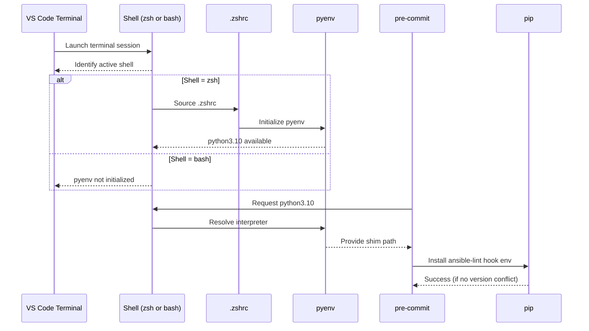

# pi-log Architecture

This document provides a high-level overview of the pi-log system, including data flow, shell/runtime behavior, and supporting infrastructure. It is intended for future maintainers who need to understand how the system is structured and how its components interact.

---

## 1. System Overview

pi-log consists of:

- A macOS development environment using:
  - VS Code
  - pyenv
  - Python 3.9 (runtime)
  - Python 3.10 (pre-commit hooks)
- A Raspberry Pi 3 deployment target running:
  - Python 3.9
  - systemd-managed ingestion service
  - serial device reader
  - SQLite or remote API push client

---

## 2. High-Level Architecture Diagram

```mermaid
flowchart LR

A[Developer Workstation (macOS)] --> B[VS Code Terminal]
B --> C{Shell}
C -->|zsh| D[.zshrc]
C -->|bash| E[No pyenv init]

D --> F[pyenv]
F --> G[Python 3.9 (runtime)]
F --> H[Python 3.10 (pre-commit)]

G --> I[.venv (project)]
H --> J[pre-commit hook envs]

I --> K[pi-log application]
J --> L[ansible-lint hook]

K --> M[Raspberry Pi 3 Deployment]
```

---

## 3. Sequence Diagram: Shell → pyenv → pre-commit



---

## 4. Component Summary

### macOS Development Environment
- Ensures reproducible builds
- Provides pyenv-managed Python versions
- Runs pre-commit hooks for linting and formatting

### Raspberry Pi 3 Runtime
- Executes ingestion pipeline
- Runs systemd-managed services
- Communicates with serial devices
- Pushes data to LogExp API

---

## 5. Deployment Flow

1. Developer writes code on macOS  
2. pre-commit enforces linting and formatting  
3. Code is deployed to Raspberry Pi  
4. systemd starts ingestion service  
5. Serial reader collects data  
6. Data is stored locally or pushed to API  

---

## 6. Future Extensions

- Add API authentication
- Add remote logging
- Add health checks for systemd
- Add metrics export (Prometheus)
