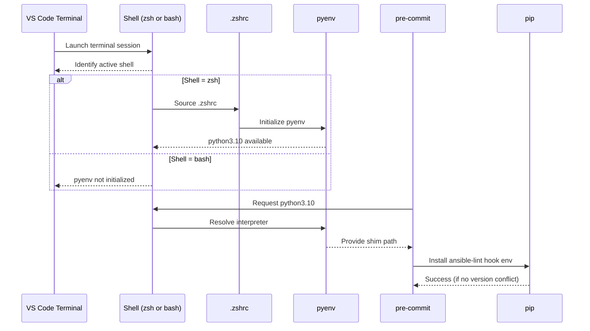

# Sequence Diagram — Shell → pyenv → pre-commit

(See architecture.md for embedded version)

```mermaid
sequenceDiagram
    participant VSCode as VS Code Terminal
    participant Shell as Shell (zsh or bash)
    participant Zshrc as .zshrc
    participant Pyenv as pyenv
    participant PreCommit as pre-commit
    participant Pip as pip

    VSCode->>Shell: Launch terminal session
    Shell-->>VSCode: Identify active shell

    alt Shell = zsh
        Shell->>Zshrc: Source .zshrc
        Zshrc->>Pyenv: Initialize pyenv
        Pyenv-->>Shell: python3.10 available
    else Shell = bash
        Shell-->>VSCode: pyenv not initialized
    end

    PreCommit->>Shell: Request python3.10
    Shell->>Pyenv: Resolve interpreter
    Pyenv-->>PreCommit: Provide shim path

    PreCommit->>Pip: Install ansible-lint hook env
    Pip-->>PreCommit: Success (if no version conflict)
```
